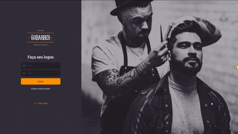

# Go Barber

<div>
	
</div>

### :question: Sobre

Projeto GoBarber desenvolvido no Bootcamp 11 da RockeatSeat, com adição de algumas melhorias (por mim) no quesito animações e lógica.

#### Tecnologias usadas:

- [NodeJS](https://nodejs.org/en/)
- [ReactJS](https://pt-br.reactjs.org/)
- [ExpressJS](https://expressjs.com/pt-br/)
- [JWT](https://jwt.io/)
- [Yup](https://github.com/jquense/yup)
- [Styled-Components](https://styled-components.com/)
- [MongoDB](https://www.mongodb.com/)
- [Postgres](https://www.postgresql.org/)
- [Redis](https://redis.io/)

#### :collision: Preview da aplicação web

<div align="center"> 

</div>

### :sparkles: Iniciando o projeto

#### Clone o projeto

```sh
$ git clone https://github.com/MaurilhoB/GoBarber.git
$ cd gobarber
```

#### Backend

Após subir uma instancia do Postgres, Redis e MongoDB execute:

```sh
$ cd backend
$ yarn && yarn dev:server
```

#### Frontend Web

```sh
$ cd web
$ yarn && yarn start
```

#### Aplicação Mobile

```sh
$ cd mobile

No Android
$ yarn && yarn android

No IOS
$ yarn && yarn ios
```
